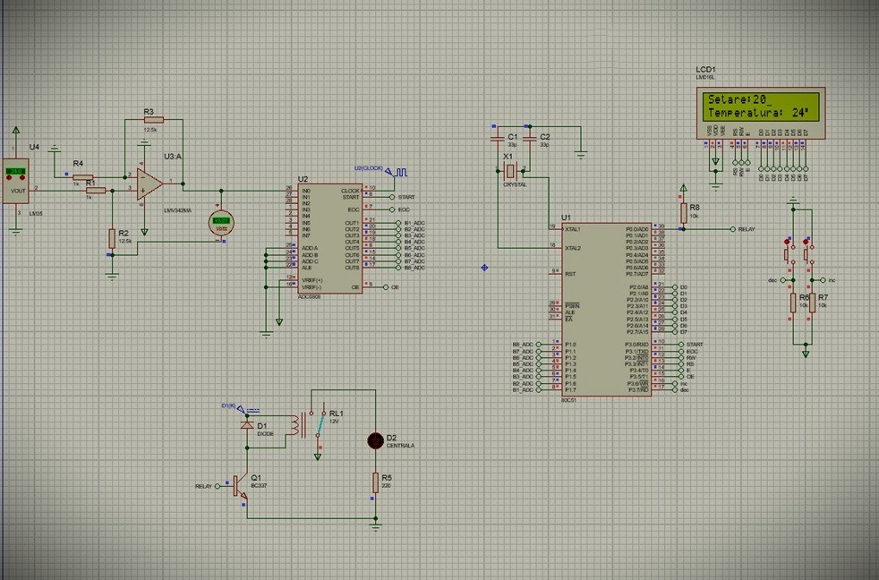

University: Technical University of Cluj-Napoca  
Course: Microcontrollers  
Author: Zabunov Veaceslav Daniil  
Year: 2023  

Project Overview

This project is a microcontroller-based room thermostat designed to measure, display, and control room temperature using an 8051 microcontroller, an LM35 analog temperature sensor, and an LCD display.  
The system enables real-time temperature monitoring and allows users to set a desired temperature threshold through push-button controls.  
Once the temperature threshold is set, the system activates or deactivates a relay to control heating or cooling, providing an efficient feedback loop to maintain a desired room temperature.  

Project Components

1. Temperature Sensor (LM35)  
    
The LM35 is a high-precision analog temperature sensor that outputs a voltage directly proportional to temperature in Celsius.  
It offers a linear voltage output with a sensitivity of 10mV per °C, ensuring accuracy and ease of calibration.  
The sensor’s output is connected to an amplifier and then fed into the ADC0808 for conversion to a digital signal readable by the microcontroller.  

2. Analog-to-Digital Converter (ADC0808)  

The ADC0808 converts the analog voltage signal from the LM35 sensor into an 8-bit digital value that the 8051 microcontroller can process.  
The ADC0808 utilizes a successive approximation method and requires a start command and an end-of-conversion signal to communicate the conversion status back to the microcontroller.  

3. 8051 Microcontroller  
  
The 8051 microcontroller, chosen for its compatibility and efficient instruction set, manages the data from the ADC, processes the temperature information, and controls the LCD display.  
Additionally, the microcontroller manages user input for temperature setting via push-buttons and monitors the threshold conditions to control an output relay.    

4. LCD Display (LM016L)
  
The 16x2 character LCD display provides a user interface for temperature feedback.    
The display shows real-time temperature values and allows for the visualization of user-set thresholds.    
The microcontroller sends commands to the LCD through standard communication protocols to control character placement, cursor positioning, and data updates.  

5. Relay Control  
The thermostat system includes a relay circuit to enable or disable an external heating or cooling device based on the current temperature compared to the set threshold.  
The relay is controlled via a transistor circuit, where the microcontroller sends signals to energize or de-energize the relay, thereby turning the external device on or off.  

Key Features

-Real-Time Temperature Measurement: Continuous temperature monitoring via the LM35 sensor.  
-Digital Display: Real-time display of temperature on the LCD for easy user access.  
-Temperature Threshold Setting: Users can set a desired temperature using push-buttons. The system compares the current temperature with this threshold and controls a relay accordingly.  
-Automated Relay Activation: Based on temperature readings, the relay is activated or deactivated to maintain room temperature within the desired range.  
-High Accuracy and Stability: The system leverages precision components (LM35, ADC0808) and calibration to maintain reliable temperature readings and control.  

Code Overview  

The project is coded in C for the 8051 microcontroller, with sections for initialization, ADC data reading, LCD control, and relay handling. Key parts of the code include:  

-LCD Initialization and Control: Sets up the LCD in 8-bit mode and provides functions for data display.  
-ADC Control and Conversion: Manages the start of analog-to-digital conversion and reads converted data from the ADC0808.  
-Temperature Comparison Logic: Compares the current temperature against the set threshold and controls relay activation.  
-Delay Functions: Implements timing control for LCD data processing and ADC conversion.  

How to Use

1. Setup: Connect the LM35 sensor to the ADC0808, then connect the ADC and LCD to the 8051 microcontroller. Ensure the relay is connected to the control pin of the microcontroller.    
2. Run the Program: Load and run the code on the 8051 microcontroller.  
3. Temperature Display and Adjustment: The LCD will display the room temperature in real-time. Use the push-buttons to set a desired temperature threshold.  
4. Relay Control: When the room temperature is above the threshold, the relay activates, signaling the connected device to turn on or off as needed.

Technical Documentation

The project documentation includes schematic diagrams, component descriptions, and the source code, providing a comprehensive guide to replicating or modifying the design for similar applications.
